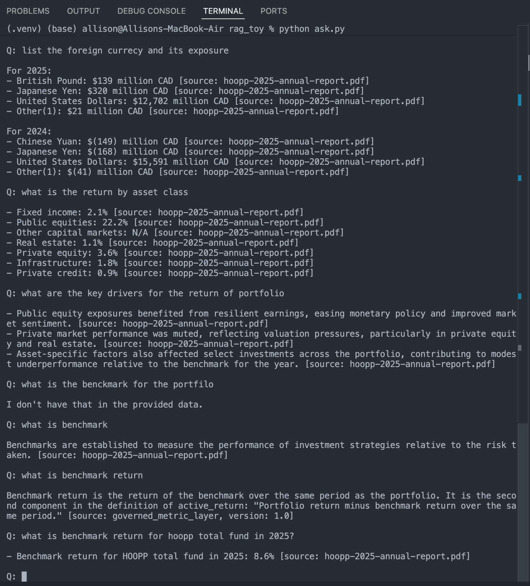

# RAG Toy — Investment Knowledge Base


A small, deliberately-readable **Retrieval-Augmented Generation (RAG)** demo that answers
questions about an investment firm's reports and metric definitions — grounded in the
source data, with citations, and refusing to answer when the data doesn't contain it.

It combines two kinds of knowledge in one vector store:

1. **A governed metric layer** — canonical, versioned definitions (e.g. *tracking error*,
   *Sharpe ratio*) from [`data/metrics.yaml`](data/metrics.yaml).
2. **Unstructured documents** — narrative text *and* tables extracted from a PDF annual
   report in [`data/docs/`](data/docs/).

## Highlights

- **Grounded, cited answers.** The model answers **only** from retrieved context and tags
  every fact with its source; governed metrics carry their version.
- **Refuses out-of-scope questions.** If the answer isn't in the data, it replies
  *"I don't have that in the provided data."* — refusal lives in generation, not retrieval.
- **Provider-agnostic LLM.** DeepSeek / OpenAI / Claude behind one `complete()` function —
  switch with a single line in `.env`, no code changes.
- **Local, offline embeddings.** Uses Chroma's built-in `all-MiniLM-L6-v2` (384-dim) — no
  embedding API key or cost.
- **Table-aware PDF ingestion.** Plain text extraction mangles financial tables into
  unaligned "number soup"; a separate `pdfplumber` path recovers them as clean tables so
  the model can actually read them.

## How it works

```
                          ┌─────────────── Step 1: ingest.py (run once) ───────────────┐
  data/metrics.yaml  ─────┤  chunk + embed (local MiniLM) ──▶ Chroma vector store       │
  data/docs/*.pdf    ─────┤    · prose  (pypdf)                (chroma_db/)              │
                          │    · tables (pdfplumber → Markdown)                          │
                          └─────────────────────────────────────────────────────────────┘

  question ─▶ retrieve top-k chunks ─▶ build cited context ─▶ LLM answers from context ─▶ answer
             └──────────── Step 2: query.py (R only) ────────┘
             └──────────────────── Step 3: rag.py (R + A + G) ─────────────────────────┘
```

- **R**etrieval: embed the question with the *same* local model, return the nearest chunks.
- **A**ugment: stitch the chunks into one context block, each tagged `[source: ...]`.
- **G**enerate: send `system rules + context + question` to the selected LLM.

## Project structure

| File | Role |
|------|------|
| `ingest.py` | Build the vector store from `metrics.yaml` + PDFs (prose via pypdf, tables via pdfplumber). |
| `query.py`  | Retrieval-only demo — prints the nearest chunks. **No LLM, no API key.** |
| `rag.py`    | Full RAG: retrieve → build cited context → answer with the selected LLM. |
| `llm.py`    | Provider-agnostic `complete()` for DeepSeek / OpenAI / Claude. |
| `ask.py`    | Interactive command-line Q&A. |
| `test_a.py` | Non-interactive smoke test (includes the must-refuse case). |
| `review/compare_search_vs_rag.py` | Side-by-side demo: **retrieval-only** vs **retrieval + LLM** on the same question. |
| `data/`     | `metrics.yaml` (governed metrics) + `docs/*.pdf` (source documents). |

## Setup

```bash
# 1. Create a virtual environment and install dependencies
python -m venv .venv
source .venv/bin/activate          # Windows: .venv\Scripts\activate
pip install -r requirements.txt

# 2. Configure a provider
cp .env.example .env
#    Edit .env: set RAG_PROVIDER (deepseek | openai | claude)
#    and fill in ONLY that provider's API key.

# 3. Build the vector store (one-time; re-run when data changes)
python ingest.py
```

> **Heads-up:** `ingest.py` needs a PDF in `data/docs/` first — none is bundled; see [Example](#example) for the one used here and how to add your own.

Embeddings run locally, so `ingest.py` and `query.py` need **no API key** — only answer
generation (`rag.py` / `ask.py`) calls a provider.

## Usage

```bash
# Retrieval only — see what the vector store returns (no LLM)
python query.py "what is tracking error"
python query.py "tracking error" "how to calculate sharpe ratio"   # multiple questions

# Full RAG — interactive Q&A
python ask.py

# One-off from your own code
python -c "from rag import answer; print(answer('what was the funded status, and as of when?'))"

# Smoke test
python test_a.py

# Compare retrieval-only vs full RAG on the same questions
python review/compare_search_vs_rag.py
python review/compare_search_vs_rag.py "what is tracking error" "what was the funded status?"
```

The comparison script makes the value of the **G** step concrete: the left side hands back
raw chunks you read yourself; the right side is the LLM's cited answer over those same chunks
(and its refusal when the answer isn't there).

## Example
Take HOOPP [2025 Annual Report](https://hoopp.com/docs/default-source/investments-library/annual-reports/hoopp-2025-annual-report.pdf) (PDF) as example
`python ask.py` answering a series of questions against the annual report:



Note the per-fact `[source: ...]` citations, the full table read back row by row, the
*"I don't have that in the provided data."* refusal, and the governed metric answered with
its `version: 1.0`.

> **Note:** the PDF isn't bundled — download it into `data/docs/` (or drop in your own) before running `ingest.py`. `data/metrics.yaml` *is* included, so the pipeline still runs without a PDF.

## Design notes

- **Why a governed metric layer?** Definitions are authoritative and versioned, kept
  separate from narrative prose so a question can pull whichever is relevant and the answer
  can cite the exact definition + version.
- **Why extract tables separately?** `pypdf` reads a PDF in text-object order, which
  scrambles table cells (labels and numbers get disconnected). `pdfplumber` reconstructs
  rows; a numeric-row filter drops prose swept in by the text strategy, and each table is
  serialized as a Markdown block prefixed with its page's prose so it stays retrievable.
- **Why refuse?** A strict system prompt (`rag.py`) forbids answering from outside the
  provided context — the main guard against hallucination.

## Limitations

- Retrieval/table extraction are tuned heuristics; a very differently-formatted PDF may need
  adjusted settings. Scanned (image-only) PDFs need OCR, which is out of scope.
- `ingest.py` re-embeds everything on every run (full overwrite via stable ids + upsert); it
  is not incremental, and deleting a source file leaves its old chunks until `chroma_db/` is
  removed and rebuilt.

## Tech stack

Python · [ChromaDB](https://www.trychroma.com/) (local `all-MiniLM-L6-v2` embeddings) ·
[pypdf](https://pypdf.readthedocs.io/) · [pdfplumber](https://github.com/jsvine/pdfplumber) ·
DeepSeek / OpenAI / Anthropic SDKs
